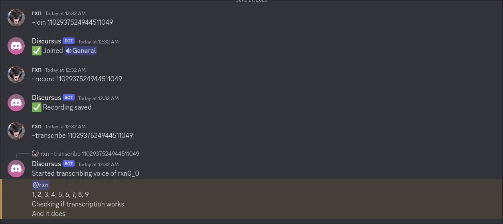
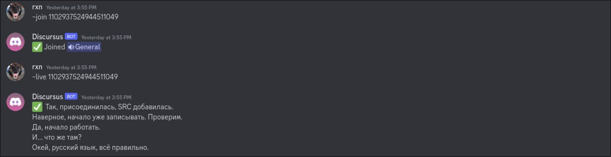

# DiScribe

# What is it?
DiScirbe is a mix of discord voice-chat RECORDER and SPEECH-TO-TEXT converter in a form of a Discord Bot.  
**IN ACTIVE DEVELOPMENT**  
```
⚠️ WARNING ⚠️

DiScribe was done as a fun project and for educational purposes only.  
However, it is planned to be rewritten into a more maintainable tool in the future.
```

## How it works


Firstly you need to build Whisper.cpp and download *ggml-medium.bin* model.  
⚠️ **For now, there is a minimum requirement of >= 2GB of graphics card memoryy**  
Create a file in a repo directory named discord.token and put your discord bot token inside.  
After setting everything up (full instruction will be added soon) and adding the bot into your discord channel there are 3 commands ready to use.

1. ```~join <channel_id> - Joins a voice channel and instantly starts recording everything.```
2. ```~record <channel_id> - Saves what has been recorded into a RECS directory.```
3. ```~transcribe <channel_id> - Tries to convert recoreded tracks into text. On success, replies to a command sender with what it managed to decode.```
4. ```~live <channel_id> - Live speech recognition inside the voice channel```  



## Used tools
Here's a list of tools without which DiScribe would have never been created.

1. [Whisper.cpp](https://github.com/ggerganov/whisper.cpp) - the only tool used to convert speech to text
2. [Serenity.rs](https://github.com/serenity-rs/serenity) - the best DiscordAPI library for Rust out there

## TODO
- [x] RealTime speech-to-text conversion in voice chats
- [ ] Use WhisperAPI instead of async process spawning to get rid of any extra overhead
- [ ] Profiling and more optimisation 
- [ ] More error handling
